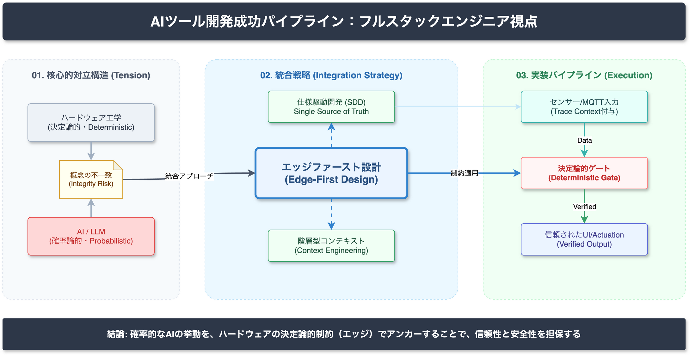

<!-- _class: title -->

# フルスタックエンジニア向け
# AIツール開発の成功戦略

AI Tool Development Success: An Implementer's Perspective
2026-03-14 | AI Research Agent v2.2.0

---

<!-- _class: light -->

## エグゼクティブサマリー

本調査により、フルスタックエンジニアがAIツール開発で成功するための3つの核心的原則が特定されました。

- **Spec-Driven Development (SDD)**: 自然言語の曖昧さを排除し、機械可読な仕様書を正（Single Source of Truth）とする開発フローへの移行が不可欠。
- **決定論的ゲートの実装**: AIの確率的挙動（Probabilistic）を、ハードウェア/ソフトウェアの決定論的ロジック（Deterministic）で制御する非対称性の管理が重要。
- **エッジファースト設計**: クラウド依存を脱却し、ハードウェア制約を起点としたローカル推論アーキテクチャを採用することで、リスクとコストを最小化できる。

---

<!-- _class: light -->

## Finding 1: Spec-Driven Development (SDD) High

従来のコード中心開発から、仕様書中心開発へのパラダイムシフトが発生しています。

- **Claim**: 機械可読な仕様書（Markdown/YAML）を正とすることで、AI Agentの確率的な挙動を制御可能になる。
- **Evidence**: GitHub Spec KitやSuperSpec等のツールにより、仕様書からコード・テストを一貫生成するフローが確立。
- **Impact**: 「Architecture Drift（仕様と実装の乖離）」を防止し、開発の手戻りを劇的に削減。
- **Action**: 自然言語の仕様書ではなく、構造化されたSpecを記述することからプロジェクトを開始する。

---

<!-- _class: light -->

## Finding 2: AI時代のTDD/BDD High

テスト駆動開発（TDD）は、AIが生成するコードの品質保証において新たな役割を担います。

- **Claim**: TDDはAIコード生成における「実装の正解判定器」として機能し、BDDはAIとの共通言語となる。
- **Evidence**: テストファーストのアプローチは、AI特有の幻覚（Hallucination）を検知するガードレールとして最も有効。
- **Detail**: "Given-When-Then" 形式の記述は、AIの推論精度（Chain of Thought）を向上させる効果が確認されている。
- **Conclusion**: テストコードは人間が書き、実装コードはAIに書かせる分業が最適解。

---

<!-- _class: light -->

## Finding 3: 決定論と確率論の対立 High

ハードウェアエンジニアリングとAI開発の間には、根本的な思考モデルの相違が存在します。

- **Claim**: 「仕様→実装→検証」の決定論的パイプラインは、確率的なLLM開発にそのまま適用できない。
- **Gap**: ハードウェアは「同一入力＝同一出力」を前提とするが、AIは「統計的分布」に従う。
- **Risk**: この非対称性を認識しないまま開発を進めることが、AIプロジェクト失敗の主因となっている。
- **Solution**: Pass/Failのバイナリ判定ではなく、受容エンベロープ（許容範囲）による検証が必要。

---

<!-- _class: light -->

## Finding 4: コンテキストエンジニアリングへの移行 Medium

AIへの指示技術は、単発の「プロンプト」から、全体的な「コンテキスト」設計へ進化しています。

- **Claim**: AIのミスの70%以上はモデル性能ではなく、不適切なコンテキスト管理に起因する。
- **Shift**: Prompt Engineering（点）から Context Engineering（線・面）へ主戦場が移行。
- **Strategy**: 情報を構造化し、フロー制御を行うことで、AIのパフォーマンスを最大化できる。
- **Requirement**: MQTT + Trace Context + OpenTelemetry属性による、センサーデータと操作ログの統合管理。

---

<!-- _class: alert -->

## Critical Risks: 開発における重大な脅威

以下のリスク要因を排除しなければ、プロジェクトは高い確率で失敗します。

- **Architecture Drift**: 仕様書と実装コードが乖離し、AIが誤った前提で修正を繰り返し、システムが崩壊する現象。
- **確率的挙動の誤解**: ハードウェアエンジニアがAIに「100%の再現性」を求め、過剰なチューニングでプロジェクトが停滞する。
- **コンテキストの質の低下**: 冗長または不正確な情報をAIに与え続けることで、推論精度が著しく低下する。
- **クラウドネイティブ偏重**: リアルタイム性が求められるエッジデバイス制御において、クラウドLLMのレイテンシがボトルネックとなる。

---

<!-- _class: light -->

## 信頼性評価 (Confidence Overview)

本調査におけるデータの信頼性分布は以下の通りです。

| 指標 | 件数 | 詳細 |
|------|------|------|
| **High Confidence** | **25** | 一次情報または複数独立ソースによる裏付けあり |
| **Medium Confidence** | **9** | 信頼できるソースはあるが、定量的補強が必要 |
| **Low Confidence** | **0** | 推測のみ、または情報不足 |
| **総 Claim 数** | **34** | 検証対象となった主要な主張の総数 |

 

**情報源の構成**:
公式文書/標準化団体 (Tier 1): 10件
企業/研究機関 (Tier 2): 9件

---

<!-- _class: light -->

## アーキテクチャ概念図

推奨される「エッジファースト・コンテキスト設計」の概念図

- **センサー取得層**: MQTTによる軽量データ収集
- **エッジ推論層**: ローカルでの即時判断とフィルタリング
- **クラウド推論層**: 複雑な文脈理解と大規模処理
- **UI反映層**: ユーザーへのフィードバック

これらを単一設計原則で貫通させることが、フルスタックエンジニアの強みです。

---

<!-- _class: light -->

## 現状の制約と未解決課題 (Limitations)

以下の領域については、現在の調査で一次情報による完全な裏付けが得られていません。

- **エッジ実装の定量的メトリクス**: ハイブリッド設計における「応答速度100ms以下」という数値目標に対する、具体的なハードウェア構成のベンチマークデータ。
- **コンテキスト同期の精度**: 分散環境における「±3秒結合窓」の実現可能性に関する実証データ。
- **特定のハードウェア要件**: 具体的MCU（Micro Controller Unit）のリソース制約下でのLLM動作検証データ。

これらの項目は、プロジェクト初期の実機検証（PoC）で優先的に確認する必要があります。

---

<!-- _class: success -->

## 推奨アクションプラン (Recommendations)

成功確率を最大化するための、実装者が即座に着手すべきロードマップです。

1.  **Spec-Driven体制の構築**: 開発の第一歩として、コードではなく「検証可能な仕様書（Spec）」の記述環境を整備する。
2.  **決定論的ゲートの実装**: AIの出力そのまま使わず、ルールベースや型チェックによる「防波堤」をコード内に設置する。
3.  **エッジファースト設計の採用**: クラウドLLMへの依存を最小限に抑え、ローカルで完結する機能を優先して実装する。
4.  **階層型コンテキストの設計**: センサーデータと操作ログを統合し、AIが必要な情報に即座にアクセスできる基盤を作る。

---

<!-- _class: dark -->

## Conclusion

**「エッジファースト設計」こそが唯一の解である。**

フルスタックエンジニアのスキルセット（Web/モバイル/HW）を活かし、ハードウェア制約を起点とした設計を行うことで、AIの不確実性を制御下に置くことが可能です。
クラウドネイティブな幻想を捨て、物理的な制約と仕様の厳密さを武器に開発を進めてください。
