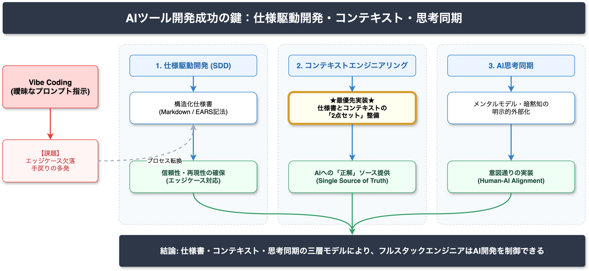

<!-- _class: title -->

# AIツール開発成功の鍵
## 仕様駆動開発、AI思考同期、コンテキストエンジニアリング

2026-03-14
AI Research Agent v2.2.0

---

<!-- _class: light -->

## Executive Summary

AIツール開発の成功率は、**「仕様書を正解とする開発プロセス (SDD)」「人間とAIの思考同期」「構造化コンテキスト管理」**の三層モデルによって最大化されます。

*   **脱 Vibe Coding**: 自然言語プロンプトへの依存から、構造化仕様書への移行が不可欠。
*   **コンテキストの外部化**: 暗黙知を明示的なデータとして管理し、AIと同期させる。
*   **即時アクション**: 仕様書ファイルとコンテキストファイルの二点セット整備が最優先事項。

---

<!-- _class: light -->

## Finding 1: 仕様駆動開発 (SDD) への移行 High

曖昧なプロンプト駆動（Vibe Coding）から、明確な仕様書を正解とする「仕様駆動開発」への移行が、生成コードの信頼性を劇的に向上させます。

*   **Claim**: Vibe Coding は構造的欠陥（エッジケース欠落）を内包する。
*   **Evidence**:
    *   GitHub Spec Kit や AWS Kiro が「仕様策定→実装」のフェーズ分離を採用。
    *   EARS記法などの構造化記述により、非機能要件の漏れを防ぐ。
    *   仕様書を Single Source of Truth とすることで再現性を確保。

---

<!-- _class: light -->

## Finding 2: AI思考同期 (Thought Synchronization) Medium

開発者の「メンタルモデル」とAIの「コンテキスト」を同期させることが、意図通りのツール作成に不可欠です。

*   **Claim**: 人間の思考の変化をリアルタイムでAIに反映させる必要がある。
*   **Evidence**:
    *   **思考パートナー**: Human-AI Alignment の文脈での研究。
    *   **暗黙知の外部化**: 背景、制約、好みを Context Files として明示化。
    *   **クロック同期**: ハードウェア開発のように、状態を常に一致させるプロセス。

---

<!-- _class: light -->

## Finding 3: コンテキストエンジニアリング High

構造化されたコンテキスト管理システムの実装が、AI生成の品質を安定させます。

*   **Claim**: 三層のコンテキスト（Project, User, Session）の体系的管理が重要。
*   **Evidence**:
    *   独立したコンテキストファイルによる情報の整理。
    *   AIエージェントが常に参照可能な状態の維持。
    *   エンジニアリングプロセスとしてコンテキストを設計・運用する。

---

<!-- _class: alert -->

## Critical Risks: Vibe Coding の代償

自然言語プロンプトのみに頼る「Vibe Coding」は、深刻なリスクを伴います。

*   **非機能要件の欠落**: セキュリティ対策やエラー処理が無視されやすい。
*   **手戻りの多発**: 仕様が曖昧なため、意図しない実装が繰り返される。
*   **技術的負債**: 構造化されていないコードベースが生成され、保守性が低下する。
*   **同期ズレ**: 開発者の意図とAIの認識が乖離し、プロジェクトが迷走する。

---

<!-- _class: light -->

## Confidence Overview

今回の調査結果の確信度分布と情報源の信頼性です。

| Level | 件数 | 定義 |
|-------|------|------|
| High | 10 | 一次情報または複数独立ソースで裏付けあり |
| Medium | 6 | 信頼できるソースあり、ただし補強不足 |
| Low | 0 | 推測を含む、または情報不足 |

*   **Tier 2 (高信頼)**: 6件 (企業公式・研究機関)
*   **Tier 3 (参考)**: 5件 (技術ブログ・業界記事)

---

<!-- _class: light -->

## 概念図：仕様駆動とコンテキスト同期

*   **仕様駆動 (SDD)**:
    Spec Files を正解として実装を生成。

*   **コンテキスト同期**:
    Context Files を介して人間とAIの認識を一致させる。

*   **フィードバックループ**:
    検証結果に基づき、コードではなく「仕様とコンテキスト」を更新する。

---

<!-- _class: light -->

## Limitations: 未解決の課題

調査において以下の限界と未解決事項が特定されました。

*   **用語の未確立**: 「AI Thought Synchronization」は確立された技術用語ではなく、概念段階である (Medium)。
*   **一次情報の不足**: 公式文書や標準化団体による Tier 1 の情報源がまだ少ない。
*   **ベストプラクティスの流動性**: ツールや手法が急速に進化しており、標準化の途上にある。

---

<!-- _class: success -->

## Recommendations: アクションプラン

開発者が今すぐ取り組むべき優先事項です。

1.  **仕様書の正解化 (SDD導入)**
    *   Markdown や EARS記法で構造化された仕様書を作成する。
    *   プロンプトではなく、仕様書を修正してコードを再生成するフローを徹底する。

2.  **コンテキストファイルの整備**
    *   プロジェクト背景、制約条件、好みを記述したファイルを常備する。
    *   開発者の暗黙知を明示的なデータとして外部化する。

3.  **同期プロセスの確立**
    *   思考の変化に合わせてコンテキストを更新する「Mutual Update」を習慣化する。

---

<!-- _class: dark -->

## Conclusion

**「仕様書」と「コンテキスト」が、AI共創時代の新しいソースコードになる。**

コードを直接書くのではなく、AIが参照する「正解」を設計・管理することにエンジニアリングの本質がシフトしています。
