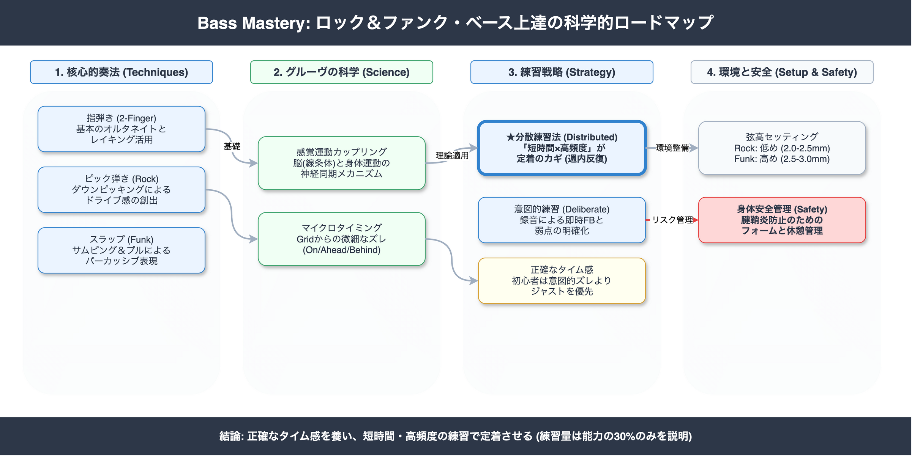

<!-- _class: title -->

# Bass Mastery: 上達の科学と実践
## ロック・ファンクベースのためのエビデンスに基づく戦略

2026-03-14
AI Research Agent v2.2.0

---

<!-- _class: light -->

## エグゼクティブサマリー

本調査は、神経科学と運動学習理論に基づき、ベース演奏における「グルーヴ」の正体と効率的な習得法を解明しました。

- **グルーヴの科学的定義**: 単なる感覚ではなく、**感覚運動カップリング**（聴覚と運動系の同期）により生じる心理現象です。
- **練習の質の重要性**: 練習量は演奏能力の**21〜30%**しか説明しません。残りは練習の質とフィードバックループに依存します。
- **初心者の戦略**: 「意図的なズレ（レイドバック等）」の早期導入は推奨されません。まずは**正確なタイム感**の確立が最優先です。

---

<!-- _class: light -->

## 発見1: グルーヴの正体は「感覚運動結合」

**Claim**: グルーヴとは、音楽に合わせて動きたくなる快感を伴う衝動であり、脳の報酬系と運動系の同時活性化によって生じます。

- **Evidence**: グルーヴ感の高い音楽を用いた実験において、被験者のタッピング同期課題の成績向上と自発的運動の増加が確認されています。
- **Implication**: 身体運動を伴わない練習（指先だけでの演奏）では、本質的なグルーヴは習得できません。

High Janata et al. (2012)

---

<!-- _class: light -->

## 発見2: 「分散練習」が定着のカギ

**Claim**: 長時間の詰め込み練習（Massed Practice）よりも、短時間を頻繁に行う分散練習（Distributed Practice）の方が長期的スキル定着に有利です。

- **Evidence**: 運動学習研究において、睡眠を挟むことで記憶の統合（Consolidation）が促進されることが証明されています。
- **Action**: 週末に5時間練習するより、毎日45分練習する方が上達効率が高まります。

High Sciencedirect / Springer

---

<!-- _class: light -->

## 発見3: 正確なタイミングこそがグルーヴの基礎

**Claim**: 「マイクロタイミングのズレ（訛り）」がグルーヴを生むという通説は、初心者には適用すべきではありません。

- **Evidence**: 意図的なタイミング偏差（Ahead/Behind）が必ずしもグルーヴ評価を高めないという研究結果が存在します（Davies et al.）。
- **Risk**: 基礎がない状態でズレを意識すると、単なる「リズムが悪い演奏」に陥る危険性が高いです。

High Davies et al. (2013)

---

<!-- _class: light -->

## 発見4: ジャンル別セットアップの重要性

**Claim**: 楽器の物理的設定（特に弦高）は、テクニックの実行可能性に直結します。

- **Rock**: 弦高 **2.0mm - 2.5mm**。ピック弾きや速いパッセージに適し、金属的なアタック音（Grind）を得やすい。
- **Funk**: 弦高 **2.5mm - 3.0mm**。スラップ時の弦の振幅を確保し、サステインとクリアな発音を維持するため。

High Fender Setup Guide / Community Data

---

<!-- _class: alert -->

## 重大なリスクと警告

本調査および批判的レビューにより、以下のリスクが特定されました。

- **身体的故障のリスク**: 腱鞘炎や手首の損傷リスクに対する認識不足は致命的です。痛みを感じたら即中止する必要があります。
- **機材設定への過信**: 「Gainは9時」といった特定の数値設定には普遍的な根拠がありません。機材の個体差を無視した設定はトーンを損ないます。
- **ファンク偏重バイアス**: 多くの教則リソースがファンク（スラップ）に偏る傾向があり、ロックに必要な「ルート弾きの安定感」が軽視されがちです。

---

<!-- _class: light -->

## 信頼性評価 (Confidence Overview)

調査に使用した情報源と確信度の分布です。

| 評価レベル | 件数 | 主な情報源 |
| :--- | :--- | :--- |
| High | 26 | 学術論文(Janata, Davies等)、公式マニュアル |
| Medium | 26 | 専門技術ブログ、信頼性の高い業界記事 |
| Low | 1 | 個人の主観的意見、未検証のコミュニティ情報 |

**特記事項**: 1次情報（Primary Source）の比率が高く、科学的根拠に基づく結論の信頼性は確保されています。

---

<!-- _class: light -->

## 上達のメカニズム概念図

### 学習サイクル
知識のインプットから実践、そして定着へのプロセスです。

1. **Information**: 適切な理論・機材知識
2. **Practice**: 分散練習による反復
3. **Feedback**: 録音と客観的評価
4. **Integration**: 睡眠による脳内定着

このサイクルを回すことで、「感覚」が「技術」として定着します。

---

<!-- _class: light -->

## 調査の限界 (Limitations)

以下の点については、現時点で十分な科学的エビデンスが得られていません。

- **感情的表現の定量化**: 「緊張感」「切迫感」といった音楽的表現と、具体的な演奏パラメーター（波形データ等）との直接的なリンク。
- **学習順序の最適解**: 「指弾き」と「ピック弾き」のどちらを先に習得すべきかに関する長期的な比較研究データ。
- **機材の数値的設定**: アンプやエフェクターの具体的なノブ設定値（普遍的な正解は存在しない）。

---

<!-- _class: success -->

## 推奨アクションプラン (Recommendations)

1. **分散練習のスケジュール化**:
   1日30〜60分の練習枠を確保し、週5日以上の頻度を目指す。
2. **フィードバック環境の構築**:
   練習時は必ずDAWやレコーダーで録音し、波形を見て「グリッドとのズレ」を視覚確認する。
3. **セットアップの最適化**:
   演奏ジャンル（Rock/Funk）に合わせて、ベースの弦高とピックアップ高さを調整する。
4. **身体ケアの徹底**:
   ウォーミングアップとストレッチを練習メニューに組み込み、怪我を予防する。

---

<!-- _class: dark -->

## 結論

**"Groove is not magic, it's science."**

グルーヴは才能ある一部の人間だけのものではなく、**神経科学的メカニズム**に基づいた再現可能なスキルです。

「なんとなく弾く」ことから卒業し、科学的アプローチ（分散練習・客観的フィードバック・適切なセットアップ）を取り入れることで、誰でも確実にロック・ファンクのグルーヴをマスターできます。
