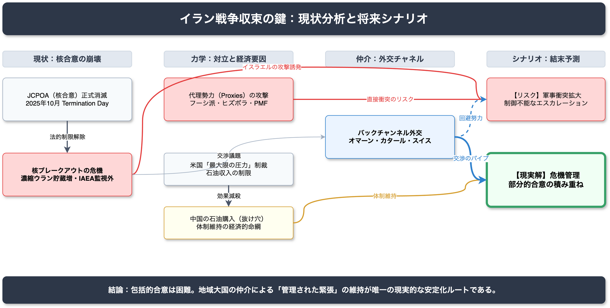

<!-- _class: title -->

# イラン戦争収束の鍵
米国・イラン間の緊張要因と外交シナリオの現状分析

2026-03-14 | AI Research Agent v2.2.0

---

<!-- _class: light -->

## Executive Summary

JCPOA（核合意）は2025年10月に正式崩壊し、イランの核活動は監視外で加速しています。

- **核危機の新局面**: 濃縮ウラン貯蔵量は兵器転用可能な水準に接近。
- **制裁の限界**: 米国の圧力は継続するも、中国の支援によりイラン体制は維持。
- **外交の現状**: 公式チャネルは凍結。オマーン・カタール等のバックチャンネルに依存。
- **地域情勢**: サウジ・イランのデタントが紛争拡大を防ぐ最後の砦。

包括的解決は困難であり、**「管理された対立」**が唯一の現実的な収束路線です。

---

<!-- _class: light -->

## 主要な発見 1: JCPOAの完全崩壊

High **Claim**
2025年10月18日の「終了日」を経てJCPOAは法的に消滅し、イランは核制限から解放されました。

**Evidence**
- **濃縮ウラン**: 約3,760kgを保有（JCPOA上限の12倍超）。
- **高濃縮**: 純度60%のウランを87.5kg保有（兵器級90%に近接）。
- **設備増強**: IR-6型高性能遠心分離機をナタンツ・フォルドゥに追加配備。

---

<!-- _class: light -->

## 主要な発見 2: 代理勢力による多面的攻撃

High **Claim**
イランの代理勢力（Proxies）による攻撃が、軍事衝突の直接的な引き金となっています。

**Evidence**
- **攻撃の常態化**: フーシ派（イエメン）、ヒズボラ（レバノン）、PMF（イラク）による米軍・イスラエル権益への攻撃。
- **直接応酬**: これに対し、2025年6月にイスラエルがイラン核施設への攻撃を実施。

---

<!-- _class: light -->

## 主要な発見 3: 外交チャネルの機能不全

High **Claim**
公式な外交チャネルは凍結状態にあり、JCPOA復活は絶望的です。

**Evidence**
- **交渉決裂**: 2025年のウィーン等での接触は相互不信により決裂。
- **枠組みの不在**: 現在は「管理された対立」または新たな枠組みを模索する段階。
- **バックチャンネル**: オマーンやカタールを通じた非公式な意思疎通のみが機能。

---

<!-- _class: alert -->

## 関連リスクと脅威

現状の膠着状態には、壊滅的なエスカレーションを招く複数のリスクが潜んでいます。

1.  **核ブレークアウト**: 兵器級ウラン製造への突入によるレッドライン越え。
2.  **イスラエルの先制攻撃**: 核武装阻止のための単独軍事行動と、それに対する報復の連鎖。
3.  **スナップバック発動**: 欧州諸国による国連制裁復活と、イランのNPT脱退措置。
4.  **代理戦争の暴発**: 地域代理勢力の攻撃による偶発的な大規模衝突。

---

<!-- _class: light -->

## データ信頼性と確信度

本調査は14件の主要な主張（Claim）に基づき、高い信頼性を確保しています。

| 確信度レベル | 件数 | 定義 |
| :--- | :---: | :--- |
| High | 10 | 一次情報または複数独立ソースで裏付けあり |
| Medium | 4 | 信頼できるソースあり、ただし補強不足 |
| Low | 0 | 推測を含む、または情報不足 |

**情報源の内訳**: 公式機関(2), 研究機関(7), 専門メディア(5)

---

<!-- _class: light -->

## 紛争構造と相関図

**エスカレーションの力学**

- **核開発**: イラン vs 米国・イスラエル・欧州
- **地域紛争**: 代理勢力 vs イスラエル・米軍
- **外交調整**: サウジアラビア・オマーン・カタールによる仲介

制裁圧力と核開発の「チキンレース」状態が継続中。

---

<!-- _class: light -->

## 制限事項と未解決課題

調査において明らかになった、現状の解決を阻む構造的な限界です。

- **包括的合意の不在**: 相互不信が深く、恒久的な条約や協定を結ぶ見通しが立たない。
- **IAEA監視の死角**: 2021年以降の協力縮小により、核活動の完全な透明性が失われている。
- **制裁の抜け穴**: 中国の輸送ネットワーク（Shadow Fleet）が経済制裁の効果を減殺。

---

<!-- _class: success -->

## 提言: 危機回避へのロードマップ

完全な解決ではなく、最悪の事態を回避するための現実的なアクションプランです。

1.  **危機管理メカニズムの確立**: 偶発的衝突を防ぐホットラインの維持。
2.  **部分的合意（Less for Less）**: 「核開発の凍結」と「制裁の一部緩和」の段階的取引。
3.  **地域外交の活用**: サウジアラビア・オマーンを介した意思疎通の継続。
4.  **レッドラインの明確化**: 軍事行動のトリガーとなる境界線の相互認識。

---

<!-- _class: dark -->

## 結論

**「解決」から「管理」へ。**

JCPOA後の世界において、即時の関係正常化は非現実的です。
核の敷居を跨がせないための**抑止**と、軍事衝突を回避するための**対話**のバランスを保ち続けることが、唯一の平和維持策となります。
