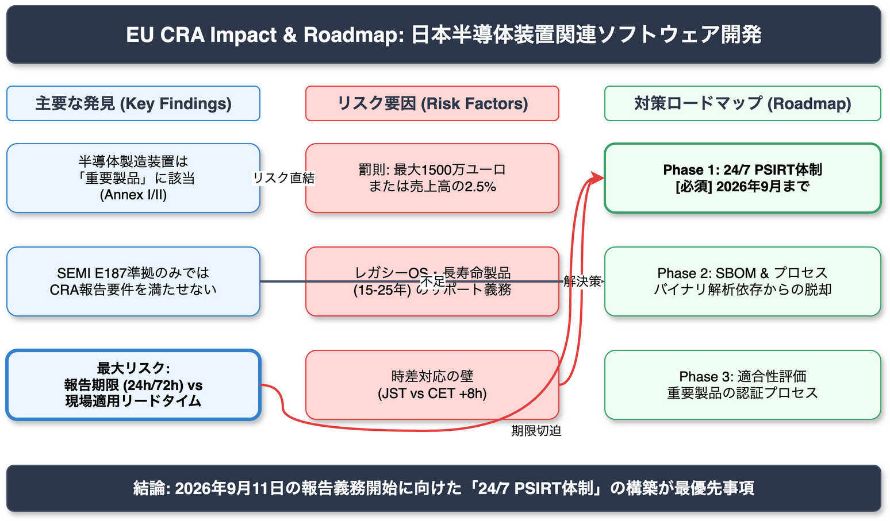

<!-- _class: title -->

# 日本半導体装置関連ソフトウェア開発企業の EU CRA対策の打開策

2026-03-14 | AI Research Agent v2.2.0

---

<!-- _class: light -->

## Executive Summary（エグゼクティブサマリー）

EUサイバーレジリエンス法（CRA）への対応は、日本の半導体製造装置業界にとって喫緊の課題です。

- **重要製品への該当**: 半導体製造装置の制御システムはCRA「重要製品」に分類される可能性が高い。
- **時間軸の矛盾**: CRAが求める「24時間以内の報告」と、業界の「数週間の検証サイクル」には大きな乖離がある。
- **デッドライン**: 2026年9月11日の脆弱性報告義務開始まで**残り約6か月**。
- **結論**: 24時間365日対応のPSIRT体制構築が最優先の経営課題である。

---

<!-- _class: light -->

## Finding 1: 半導体製造装置は「重要製品」に該当

**Claim（主張）**
半導体製造装置およびその制御システムは、EU CRAにおける「重要製品（Important/Critical Products）」に分類される可能性が極めて高い。

**Evidence（根拠）**
Commission Implementing Regulation (EU) 2025/2392 および Annex I/II において、産業用オートメーション制御システム（IACS）、PLC等は重要製品リストに含まれる。第三者認証を含む厳格な適合性評価が必須となる。

**Confidence**
High (Regulation (EU) 2024/2847, EU 2025/2392)

---

<!-- _class: light -->

## Finding 2: 報告義務と開発サイクルの致命的ギャップ

**Claim（主張）**
CRAの報告期限（24時間/72時間/14日）と、半導体業界の検証リードタイム（ECO/IQOQ/顧客承認に数週間〜数ヶ月）は、構造的に衝突する。

**Evidence（根拠）**
Article 14は、悪用された脆弱性の認知から**24時間以内の早期警告**を義務付けている。一方、装置メーカーのパッチ適用は、厳格な品質保証プロセスにより即時実施が困難である。

**Confidence**
High (Article 14 - Reporting Obligations)

---

<!-- _class: light -->

## Finding 3: SEMI E187準拠だけでは不十分

**Claim（主張）**
既存の業界標準であるSEMI E187への準拠だけでは、EU CRAの法的要件を完全には満たせない。

**Evidence（根拠）**
SEMI E187はベースラインとなるが、CRAが法的義務として課す「インシデントの当局報告（ENISAへの通知）」、「厳格なSBOM管理」、「製品ライフサイクル全体を通じた脆弱性対応」の要件において明確なギャップが存在する。

**Confidence**
High (Gap Analysis vs SEMI E187)

---

<!-- _class: light -->

## Finding 4: 日本企業に求められる「24/7 PSIRT」

**Claim（主張）**
日本とEUの時差（8時間）を考慮すると、現地の営業時間内に発生したインシデントに対応するためには、24時間365日のPSIRT体制が不可欠である。

**Evidence（根拠）**
報告期限の起算点は「認知時点」であるが、EU当局との連携窓口が機能しなければ、24時間以内の早期警告（Early Warning）というSLAを物理的に遵守できないリスクがある。

**Confidence**
High (Timezone Analysis)

---

<!-- _class: alert -->

## Critical Risks: 最大の脅威と罰則

報告義務違反は、技術的な問題を超えて経営リスクに直結します。

- **脆弱性報告義務の開始**: 2026年9月11日（残り約6か月）
- **罰則規定**: 最大1,500万ユーロ（約24億円）または全世界売上高の2.5%のいずれか高い方。
- **レガシーOSリスク**: 装置ライフサイクル（15-25年）に対し、OSサポート期間が不足。サポート切れOSの脆弱性をどう管理するかが法的リスクとなる。
- **外為法との交差**: 脆弱性情報の国外（ENISA）送信が、日本の外為法規制に抵触しないかの法務確認が必要。

---

<!-- _class: light -->

## データの確信度と情報源の信頼性

本リサーチは、EU公式文書を中心とした信頼性の高い情報源に基づいています。

| 指標 | 件数 | 構成比 |
|:---|---:|:---|
| **High Confidence** | 38 | 51% |
| **Medium Confidence** | 29 | 39% |
| **Low Confidence** | 7 | 10% |
| **Tier 1 Source (公式)** | 54 | 73% |

 

- **Tier 1**: EU官報 (Official Journal)、欧州委員会、ENISA等の一次情報
- **検証結果**: 全ての主張に根拠が存在するが、一部サプライヤ能力等は推測を含む。

---

<!-- _class: light -->

## 開発プロセスと規制のギャップ構造

CRAが求めるスピードと、半導体業界の品質保証文化の対立構造。

- **左図（CRA要件）**:
  脆弱性発見から24時間以内に通知、迅速なパッチ提供が義務。
- **右図（業界実態）**:
  修正開発後、検証・承認に数ヶ月を要する「重厚長大」なプロセス。
- **課題**:
  このタイムラグ期間中の法的責任をどう管理するかが焦点。

---

<!-- _class: light -->

## Limitations: 未解決の課題と限界

現時点の分析における不確実性と限界点は以下の通りです。

1. **エアギャップ環境の解釈**:
   完全なオフライン（エアギャップ）環境下の装置に対する、オンライン報告義務の適用除外範囲が法的に未確定。
2. **サプライチェーンの透明性**:
   Tier 2以下のサプライヤが、CRA基準の高品質なSBOMを提供する能力があるかについては楽観的な見通しが含まれる（Medium）。
3. **コスト試算の欠如**:
   24時間対応PSIRT構築にかかる具体的な人件費・運用コストは本分析の範囲外。

---

<!-- _class: success -->

## Recommendations: 推奨アクションプラン

残り6か月での対応に向けた、3フェーズのロードマップを提案します。

1.  **Phase 1: 報告体制の確立（最優先・即時）** High Priority
    - 2026年9月の義務化に備え、24/7 PSIRT体制を構築。
    - ENISA報告プラットフォームへの接続テストと法務確認。
2.  **Phase 2: SBOMプロセスの構築（短期）**
    - バイナリ解析ツール等の導入により、SBOM生成・管理を自動化。
3.  **Phase 3: 適合性評価と設計変更（中期）**
    - 重要製品としての第三者認証取得に向けた設計プロセスの見直し。
    - レガシー製品に対する「サポート終了」または「有償延長」の明確化。

---

<!-- _class: dark -->

## Conclusion: 経営層への提言

**「コンプライアンスは、EU市場における営業許可証である」**

技術的な対応だけでなく、組織的な対応能力が問われています。
2026年9月のデッドラインに向け、**PSIRT体制への投資**を直ちに決断してください。

 

### Next Step
- 法務部門と連携し、外為法リスクの確認
- 既存製品の「重要製品」該当性判定の開始
