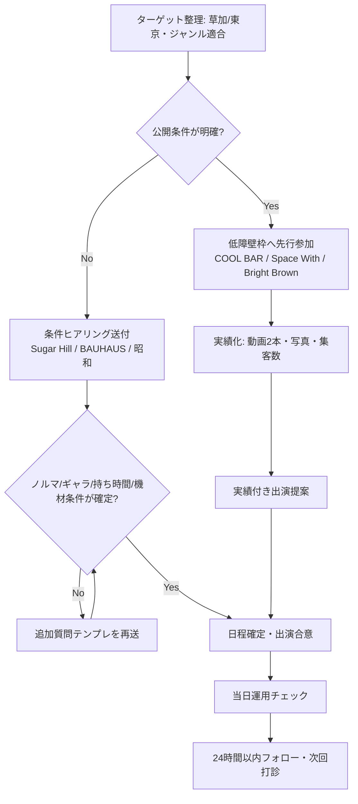

# Live-Venue Booking Technical Strategy（東京・草加周辺の出演獲得戦略）

## Findings（主要な発見）

### Claim（主張）
最短で出演実績を作るなら、**参加費型で参加手順が公開されている枠（COOL BAR / Space With / Bright Brown）**を先に回すのが最も成功確率が高い。

**Evidence（根拠）**
- COOL BARは木曜オープンマイク、`3曲交代・1,500円`の明示ルール。
- Space With「Rockin’ Tonight」は`演奏エントリー制・1,800円（ドリンク別）`を明示。
- Bright Brownは木曜セッション`1,000円＋ミニマムオーダー1,000円`を明示。

**Source（情報源）**
- [official_document/tier2] [COOL BAR 公式](https://www.coolbar0924.org/) (2026-03-14) — primary: true
- [official_document/tier2] [COOL BAR イベント一覧](https://www.coolbar0924.org/event-list) (2026-03-14) — primary: true
- [official_document/tier2] [Space With セッション](https://www.spacewith.co.jp/system/session.html) (2026-03-14) — primary: true
- [official_document/tier2] [Bright Brown SCHEDULE](https://brightbrownnakano.wixsite.com/brightbrown/schedule) (2026-03-14) — primary: true

**Confidence（確信度）**: high
### Claim（主張）
**ノルマ有無・出演料（ギャラ）**は、対象店舗の公開情報だけでは不足が多く、出演確定前の個別確認が必須。

**Evidence（根拠）**
- Sugar Hill / BAUHAUS / 昭和は、来店チャージ・連絡先は公開される一方で、出演者向け契約条件（ノルマ、バック率、ギャラ計算式）は公開が限定的。
- BAUHAUSの飛び入りは公式よりも体験系情報に依存しやすく、条件の不確実性が高い。

**Source（情報源）**
- [official_document/tier2] [Sugar Hill お問い合わせ](https://sugarhill.jp/contact/) (2026-03-14) — primary: true
- [official_document/tier2] [Sugar Hill 公式](https://sugarhill.jp/) (2026-03-14) — primary: true
- [official_document/tier2] [BAUHAUS Contact/Pricing](https://rockbarbauhaus.com/about/contact/) (2026-03-14) — primary: true
- [official_document/tier2] [BAUHAUS 価格改定告知](https://rockbarbauhaus.com/price202408/) (2026-03-14) — primary: true
- [official_document/tier2] [フォーク酒場 昭和 公式](https://showa.info/) (2026-03-14) — primary: true
- [community_data/tier4] [BAUHAUS 体験記事](https://72guitarblogger.com/rockbar-bauhaus-experience/) (2026-03-14) — primary: false

**Confidence（確信度）**: medium
### Claim（主張）
東京の一般的なライブハウス市場では、**チケットノルマ＋チケットバック型**の説明が複数ソースで一致しており、資金計画を先に作るべき。

**Evidence（根拠）**
- `チケット単価1,500〜2,500円 × 10〜20枚`相当のノルマ説明が複数メディアで反復。
- バック率・超過分還元ルールは会場ごとの差が大きい。

**Source（情報源）**
- [industry_report/tier3] [ライブハウスのノルマとは？](https://independent-artist.net/1063/) (2026-03-14) — primary: false
- [industry_report/tier3] [ライブハウスの「ノルマ」解説](https://www.shellbys.com/column/livehouse-norma) (2026-03-14) — primary: false
- [industry_report/tier3] [ライブUtaTen ノルマ解説](https://utaten.com/live/live-house-assigned/) (2026-03-14) — primary: false
- [industry_report/tier3] [チケットノルマ解説](https://www.ticket.co.jp/entx/knowhow/ticket_quota/) (2026-03-14) — primary: false

**Confidence（確信度）**: medium
## Venue Requirements Matrix（店舗別要件マトリクス）

| Venue | ノルマ有無（公開情報） | 出演料/参加費の把握可能範囲 | 予約方法 | 必要準備物（実務） | Confidence |
|---|---|---|---|---|---|
| COOL BAR（八潮） | 明示ノルマ記載なし | オープンマイク `1,500円/3曲交代` | 電話・メール・Webフォーム | 3曲セット、基本機材、短い自己紹介 | high |
| Space With（飯田橋） | 明示ノルマ記載なし | Rockin’ Tonight `1,800円（D別）` | 掲示板エントリー＋公式問合せ | 希望曲/担当パート事前記入、必要機材確認 | high |
| Bright Brown（中野） | 明示ノルマ記載なし | 木曜セッション `1,000円＋オーダー1,000円` | 電話中心（予約推奨） | ブルース標準曲への対応、音量配慮 | high |
| Sugar Hill（草加） | **未確定**（出演契約条件の公開不足） | ライブ観覧チャージ `3,000〜4,000円`、セッション参加費 `2,200円`情報あり | Webフォーム・電話（当日予約は電話） | ジャンル適合（ジャズ/ラテン寄り）、事前相談 | medium |
| BAUHAUS（六本木） | **未確定** | 入場 `4,400円（1D込）`、飛び入りは条件未固定 | 電話・メール・公式Contact、当日スタッフ相談 | クラシックロックのレパートリー、実演即応性 | medium |
| フォーク酒場 昭和（神田） | **未確定** | ミュージックチャージ（例: 男性2,200円/女性2,000円） | 電話・公式サイト予約導線 | フォーク系曲目、短尺回し前提の準備 | medium |

**Source（情報源）**
- [official_document/tier2] [COOL BAR 公式](https://www.coolbar0924.org/) (2026-03-14) — primary: true
- [official_document/tier2] [COOL BAR イベント一覧](https://www.coolbar0924.org/event-list) (2026-03-14) — primary: true
- [official_document/tier2] [Space With セッション](https://www.spacewith.co.jp/system/session.html) (2026-03-14) — primary: true
- [community_data/tier4] [Rockin’ tonight掲示板](http://www.rockin-tonight.jp/bbs/patio-i.cgi) (2026-03-14) — primary: false
- [official_document/tier2] [Bright Brown SCHEDULE](https://brightbrownnakano.wixsite.com/brightbrown/schedule) (2026-03-14) — primary: true
- [official_document/tier2] [Sugar Hill 公式](https://sugarhill.jp/) (2026-03-14) — primary: true
- [official_document/tier2] [Sugar Hill お問い合わせ](https://sugarhill.jp/contact/) (2026-03-14) — primary: true
- [community_data/tier4] [ジャズ資料館（Sugar Hill）](https://jazzshiryokan.net/jazzDB/livehouse_detail.php?recordID=H171) (2026-03-14) — primary: false
- [official_document/tier2] [BAUHAUS Contact/Pricing](https://rockbarbauhaus.com/about/contact/) (2026-03-14) — primary: true
- [official_document/tier2] [BAUHAUS 価格改定](https://rockbarbauhaus.com/price202408/) (2026-03-14) — primary: true
- [official_document/tier2] [フォーク酒場 昭和 公式](https://showa.info/) (2026-03-14) — primary: true
- [official_document/tier2] [フォーク酒場 昭和 お食事と飲み物](https://www.showa.info/f10.fooddrink.html) (2026-03-14) — primary: true
## Requirement Levels & Standard Mapping（義務レベルと法令マッピング）

### Claim（主張）
店舗出演では、**著作権処理の責任主体（会場包括契約か主催者申請か）**を確定しないまま進めるべきでない。

**Evidence（根拠）**
- JASRAC公式は、ライブハウス包括契約運用と主催形態差を説明。
- 著作権法第22条（演奏権）と第38条（非営利例外）により、商用ライブは原則許諾領域。

**Source（情報源）**
- [official_document/tier1] [e-Gov 著作権法](https://laws.e-gov.go.jp/law/345AC0000000048) (2026-03-14) — primary: true
- [official_document/tier1] [JASRAC ライブハウスにおける生演奏](https://www.jasrac.or.jp/aboutus/detail/livehouse.html) (2026-03-14) — primary: true

**Confidence（確信度）**: high

| Requirement Level | 対象主張 | Standard Reference | Mapping |
|---|---|---|---|
| MUST | 営利ライブの権利処理主体を事前確認する | 著作権法 第22条 / JASRAC運用 | direct |
| MAY | 非営利・無料・無報酬の全条件成立時の例外適用 | 著作権法 第38条 | direct |
| MUST_NOT | 権利処理未確認のまま有料ライブ実施 | 著作権法 第22条 | direct |
| SHOULD | 出演確定前にノルマ・バック率・精算日を文面で確定 | [unknown] 実務運用上の推奨 | partial |

注記: 本テーマは日本法ベースのため、EU CRA/SEMI等での「SHOULD解釈差分」は直接適用しない。
## Booking Flowchart（出演枠獲得フローチャート）

### Claim（主張）
「低障壁枠で実績化 → 実績を添えて中〜高障壁枠へ提案」の二段階が、最も再現性の高い獲得経路。

**Evidence（根拠）**
- 低障壁枠は参加手順・料金公開が明確。
- 高障壁枠は条件公開不足が多く、実績同封で交渉材料を増やす必要がある。

**Source（情報源）**
- 上記マトリクス掲載の公式各店ページ一式
- [industry_report/tier3] [初めてのブッキングライブ出演手順](https://kaede-music.net/blog/bookinglive-beginner/) (2026-03-14) — primary: false

**Confidence（確信度）**: high

## Checklist（実行チェックリスト）

### Claim（主張）
提出物を標準化すると、問い合わせ往復回数を減らし、枠獲得速度を上げられる。

**Evidence（根拠）**
- 応募系窓口はプロフィール・音源URL・連絡先を共通要求する傾向。
- オープンマイク/ブッキングの初参加ガイドは、事前のセットリスト・機材確認を強く推奨。

**Source（情報源）**
- [official_document/tier2] [MAGES デモ募集要項](https://mages.co.jp/mailform/magesmusicaudition/) (2026-03-14) — primary: true
- [industry_report/tier3] [初めてのブッキングライブ出演手順](https://kaede-music.net/blog/bookinglive-beginner/) (2026-03-14) — primary: false
- [community_data/tier4] [オープンマイクのはじめかた](https://www.openmic-navi.com/getting-started) (2026-03-14) — primary: false

**Confidence（確信度）**: medium

**A. 提出パック（事前）**
- [ ] MUST: 60〜120秒のデモ動画URLを2本（ロック/ブルース系、フォーク弾き語り系）
- [ ] MUST: 3曲ショートセット + 6曲ロングセット（曲名・キー・想定分数）
- [ ] MUST: プロフィール（活動歴3行、連絡先、SNS）
- [ ] SHOULD: ステージ要件（Vo本数、DI要否、持込楽器）
- [ ] MAY: 集客見込み（初回は保守値）

**B. 問い合わせ時（契約前）**
- [ ] MUST: ノルマの有無（枚数/金額）
- [ ] MUST: バック率（超過分の計算式）
- [ ] MUST: 支払タイミング（当日精算/後日）
- [ ] MUST: 持ち時間・転換時間・入り時間
- [ ] MUST: 機材レンタル可否・追加料金
- [ ] SHOULD: 写真/動画撮影可否（次回営業用）

**C. 当日運用**
- [ ] MUST: 受付時に条件再確認（紙/DM記録）
- [ ] MUST: 1曲目を最も通る曲に固定（初見対策）
- [ ] SHOULD: 物販/QR導線を1箇所に集約
- [ ] MUST: 終演24時間以内にお礼＋次回候補日提示
## Inquiry Template（出演条件確定テンプレート）

### Claim（主張）
条件不明店舗には、定型質問を送ることで「未確定項目（ノルマ・ギャラ）」を短時間で確定できる。

**Evidence（根拠）**
- 対象店舗の公開情報は、来店料金と連絡先の情報が中心で出演契約情報が薄い。
- 先に質問項目を固定すると比較可能なデータに変換しやすい。

**Source（情報源）**
- 上記 Venue Matrix の公式ソース一式
- [unknown] 推定情報源 (unknown)

**Confidence（確信度）**: medium

**送信テンプレ（そのまま使用可）**
1. 出演形態は「参加費型 / ノルマ型 / 買取型」のどれですか？  
2. ノルマがある場合、金額または枚数は？  
3. チケットバック率と計算開始ラインは？  
4. 出演料（ギャラ）は固定/歩合のどちらですか？  
5. 持ち時間、転換時間、入り/リハ時刻は？  
6. 必要提出物（デモ形式、セットリスト締切、告知素材）は？  
7. 機材レンタル可否と追加料金は？  
8. キャンセル規定（何日前から何%）は？  
9. 精算方法（当日現金/振込）と締め日は？  
10. 写真・動画撮影およびSNS掲載ルールは？
## Recommendations（結論・推奨事項）

### Claim（主張）
本テーマ（東京＋草加周辺、ロック/ブルース/フォーク）では、**3段階戦略**が最も効率的。

**Evidence（根拠）**
- 低障壁枠の公開条件が明確で、初速を作りやすい。
- 中〜高障壁枠は条件不確定が多く、実績と定型質問で交渉すべき。

**Source（情報源）**
- 上記 Findings/Matrix/Flow の各ソース一式

**Confidence（確信度）**: high

1. **Phase 1（0〜30日）**  
   COOL BAR・Bright Brown・Space Withで計4回参加し、実績素材（動画2本、写真、反応ログ）を作成。

2. **Phase 2（31〜60日）**  
   Sugar Hill・昭和へ実績同封で出演相談。ノルマ/ギャラ/締切をテンプレで取得し、比較表化。

3. **Phase 3（61〜90日）**  
   BAUHAUSは来店→関係構築→飛び入り打診の順で攻略。初回から“出演前提”でなく“関係構築前提”で臨む。
