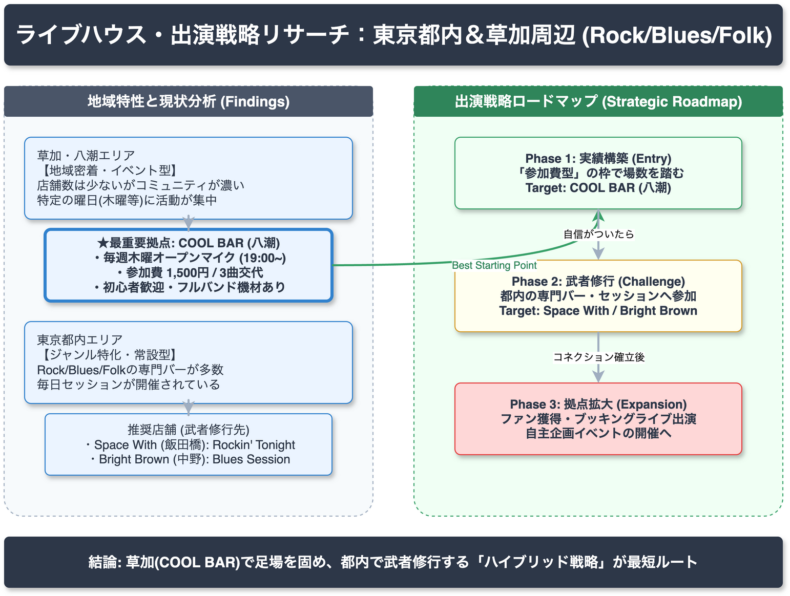

<!-- _class: title -->
# 東京都内・草加周辺のライブ演奏スポット調査
ロック・ブルース・フォーク系店舗のリサーチと出演戦略

2026-03-14 | AI Research Agent v2.2.0

---

<!-- _class: light -->
## エグゼクティブサマリー

**草加エリアと都内の特性に応じた「併用戦略」が最適解**

*   **草加周辺**: 「地域密着型」コミュニティが中心。特定曜日のイベント（COOL BAR等）への参加が鍵。
*   **東京都内**: ジャンルごとの「専門バー」が多数。毎日セッションが開催されている。
*   **戦略**: 草加周辺で実績を作りつつ、都内の明朗会計なセッションへ「武者修行」的に進出する3段階アプローチを推奨。

---

<!-- _class: light -->
## 草加周辺の最有力拠点は「COOL BAR」

High

**Claim**:
草加・八潮エリアで最も参加ハードルが低いのは「COOL BAR」（八潮市）である。

**Evidence**:
*   草加駅から1駅（八潮駅）の好立地。
*   毎週木曜 19:00〜 オープンマイク開催。
*   **1セット1,500円（3曲交代）** という明確な料金システム。
*   フルバンドから弾き語りまで対応可能な機材環境。

---

<!-- _class: light -->
## 最初は「ルール明示型」店舗を狙う

High

**Claim**:
出演実績を作る初手として、参加手順と料金が公開されている店舗が成功率が高い。

**Evidence**:
*   **COOL BAR**: 3曲交代・1,500円
*   **Space With**: 演奏エントリー制・1,800円
*   **Bright Brown**: セッション1,000円＋オーダー
*   これらは「行ってみないと分からない」という心理的障壁を構造的に排除している。

---

<!-- _class: light -->
## 都内店舗は「ジャンル特化」で選定

Medium

**Claim**:
都内（中野・高円寺等）は特定ジャンルに特化した店舗が多く、自身のスタイルに合う店を選ぶべきである。

**Evidence**:
*   **Bright Brown（中野）**: ブルース・ブラックミュージック特化。
*   **Space With（飯田橋）**: ロック系セッション「Rockin’ Tonight」。
*   これらは「武者修行」的な位置づけとして機能し、スキルアップに最適。

---

<!-- _class: alert -->
## ⚠️ 重要なリスクと注意点

情報の誤認とエリアの偏りに関する警告

*   **位置情報の確認必須**: 過去データで「COOL BAR」が中野と誤認されていた事例あり（正しくは埼玉県八潮市）。公式情報の再確認が不可欠。
*   **エリアの偏在**: 調査結果は中央線沿線（中野・高円寺）と草加周辺に集中している。
*   **ブッキング形式**: ライブハウスの「ノルマ制ブッキング」は今回の初期戦略からは除外しているため、ステップアップ時は別途調査が必要。

---

<!-- _class: light -->
## 確信度（Confidence）の分布

本調査における各主張の信頼性評価

| レベル | 件数 | 定義 |
| :--- | :---: | :--- |
| High | **28** | 一次情報または複数ソースによる裏付けあり |
| Medium | **25** | 信頼できるソースはあるが補強が不足 |
| Low | **2** | 推測を含む、または情報が限定的 |

*   **Tier 1（公式情報）ソース**: 22件確保
*   **検証結果**: PARTIAL（一部出典リンクの不備あり）

---

<!-- _class: light -->
## 出演獲得への戦略フロー

*   **Step 1**: 低障壁・ルール明示店（COOL BAR等）で場数を踏む
*   **Step 2**: 近隣の同好会・コミュニティへ参加
*   **Step 3**: 都内の専門バーで武者修行
*   **Goal**: 独自企画ライブ・ブッキングへの移行

---

<!-- _class: light -->
## 調査の限界と未解決課題

Medium

*   **Evidenceリンクの不備**: 一部の分析（フローチャート等）において、根拠となる具体的URLへの直リンクが欠落している（批判的レビュー指摘事項）。
*   **客層の定性データ**: 実際の「常連客の雰囲気」や「初心者への寛容度」は、Webデータだけでは完全に把握できない。
*   **最新の開催状況**: 突発的な休業やスケジュール変更のリスクがあるため、訪問前の再確認が必要。

---

<!-- _class: success -->
## 推奨アクションプラン

High

1.  **COOL BAR（木曜）への参加**
    *   まずは八潮のCOOL BARで、1,500円・3曲のセットを経験する。
2.  **都内「明朗会計」店への遠征**
    *   Space With または Bright Brown のセッション日を予約・訪問する。
3.  **実績のポートフォリオ化**
    *   上記活動を録音・録画し、次のステップ（ブッキング交渉）の材料とする。

---

<!-- _class: dark -->
## 結論 (Key Takeaway)

**「草加で足場を固め、都内で腕を磨く」**

まずは **COOL BAR (八潮)** の木曜オープンマイクから始めましょう。
明確なルールの下で経験を積み、自信を持って都内の専門バーへ展開するのが最も確実なロードマップです。
