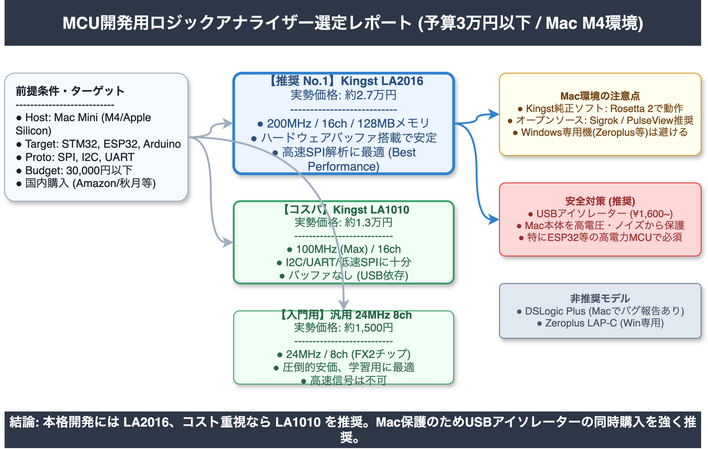

<!-- _class: title -->

# MCU開発向けロジックアナライザー選定調査
## 3万円以下・Mac M4環境における最適解

2026-03-14
AI Research Agent v2.2.0

---

<!-- _class: light -->

# Executive Summary

Mac Mini M4環境下における、3万円以下の最適なロジックアナライザー選定結果です。

*   **Best Performance**: **Kingst LA2016** (約2.7万円)
    *   16ch/200MHz、ハードウェアメモリ搭載のプロ仕様
*   **Best Cost-Performance**: **Kingst LA1010** (約1.3万円)
    *   必要十分な性能バランス
*   **Entry Level**: **汎用 24MHz 8ch** (約1,500円)
    *   低速プロトコル学習用、コスト最優先
*   **Critical Constraint**: 多くの純正ソフトはIntel版のみ。Rosetta 2またはSigrok利用が前提。

---

<!-- _class: light -->

# Finding 1: Kingst LA2016の優位性

High

予算上限に近いものの、実務レベルの解析には LA2016 が唯一の選択肢です。

*   **Claim**: 16ch/200MHz/128Mbitメモリの実効性能を持つ最良の選択肢。
*   **Evidence**: 
    *   実勢価格 22,000〜27,000円（Amazon.co.jp）。
    *   50MHzのSPI通信に対し、推奨される4倍オーバーサンプリング（200MHz）を達成可能。
    *   ハードウェアバッファにより長時間の信号キャプチャが安定。

---

<!-- _class: light -->

# Finding 2: SPI解析における性能分岐点

High

安価なモデルと高性能モデルの決定的な差は、高速SPI通信への対応能力にあります。

*   **Claim**: 汎用24MHzモデルやLA1010では、高速SPIの解析が困難である。
*   **Evidence**:
    *   **Shannonの定理**: `fs >= 2f_clock` (最低要件)
    *   **実務推奨**: `fs >= 4f_clock` (デコード安定性)
    *   汎用機(24MHz)では6MHz以上の信号でエイリアシングが発生し、デコードエラーのリスクが高い。

---

<!-- _class: light -->

# Finding 3: Mac Apple Silicon互換性

High

ハードウェア性能だけでなく、ソフトウェアの動作環境が大きな選定基準となります。

*   **Claim**: 公式ソフトウェアの多くはx86_64（Intel）ベースであり、MシリーズMacでは変換が必要。
*   **Evidence**:
    *   **KingstVIS**: macOS対応だがIntel版のみ。Rosetta 2経由で動作確認済み。
    *   **Sigrok/PulseView**: オープンソースの解析ソフト。Homebrew等でビルドすることでネイティブ動作が可能。
    *   **Zeroplus**: Windows専用のためMac環境では非推奨。

---

<!-- _class: alert -->

# Critical Risks & Warnings

購入および運用において、以下の重大なリスクを考慮する必要があります。

*   **Windows専用機の誤購入**: 秋月電子等で流通する **Zeroplus LAP-Cシリーズ** は、公式にMac非対応です。
*   **グランドループによる破損**: MCUとPCのGND電位差により、Mac本体やターゲットボードを破損するリスクがあります。USBアイソレーターの導入を強く推奨します。
*   **ソフトウェアの不具合**: DSLogic Plus等は高スペックですが、macOS環境下でのSPIデコードバグ等の報告があり、安定性に懸念が残ります。

---

<!-- _class: light -->

# Confidence Overview

本調査におけるデータの信頼性分布です。

| 確信度レベル | 件数 | 定義 |
| :--- | :---: | :--- |
| High | 51 | 一次情報または複数ソースによる裏付けあり |
| Medium | 12 | 信頼できるソースはあるが補強が必要 |
| Low | 0 | 情報不足または推測 |

**情報源の信頼性**:
*   Tier 1 (公式・規格): 25件
*   Tier 2 (論文・企業): 19件

---

<!-- _class: light -->

# Comparison & Configuration

**推奨構成図**

Mac Mini M4 (Host)
↓ USB (Rosetta 2 / Sigrok)
**Kingst LA2016**
↓ プローブ
ターゲットMCU (STM32/ESP32)

*   **I2C/UART**: 全モデルで対応可
*   **SPI (High Speed)**: LA2016以上が必須
*   **Isolation**: USBアイソレーター推奨

---

<!-- _class: light -->

# Limitations

本調査における未解決事項および制限事項です。

*   **macOS固有のバグ**: 特定のOSバージョン（Sonoma/Sequoia）とドライバの組み合わせにおける詳細な動作検証は完全ではありません。
*   **クローン品の品質**: 安価な汎用ロジックアナライザー（FX2系）は、製造元により電気特性（入力インピーダンスや保護回路）にバラつきがあります。
*   **プローブ容量**: 高速I2C (Fm+/Hs) においては、ロジックアナライザーのプローブ容量が波形鈍化の原因となる可能性があります。

---

<!-- _class: success -->

# Recommendations

High

コストパフォーマンスと将来性を考慮した具体的なアクションプランです。

1.  **Kingst LA2016を購入する**: 予算内（約2.7万円）でSPI解析までカバーできる最良の投資です。
2.  **USBアイソレーターを追加する**: Mac本体保護のため、約1,600〜3,300円のアイソレーターを同時購入してください。
3.  **環境構築**: 純正ソフト「KingstVIS」のRosetta 2動作確認、および「PulseView」の導入準備を行ってください。
4.  **Windows専用機を避ける**: スペック表だけで判断せず、macOS対応を必ず確認してください。

---

<!-- _class: dark -->

# Conclusion

**Kingst LA2016 がプロフェッショナルな最適解**

3万円以下の予算制約の中で、200MHzサンプリングとハードウェアメモリを備えた **Kingst LA2016** は、ホビー用途を超えた実務レベルのデバッグを可能にします。

Mac環境での制約（Rosetta 2等）を理解し、適切な保護対策（アイソレーター）講じることで、安全かつ高度な開発環境を構築できます。
