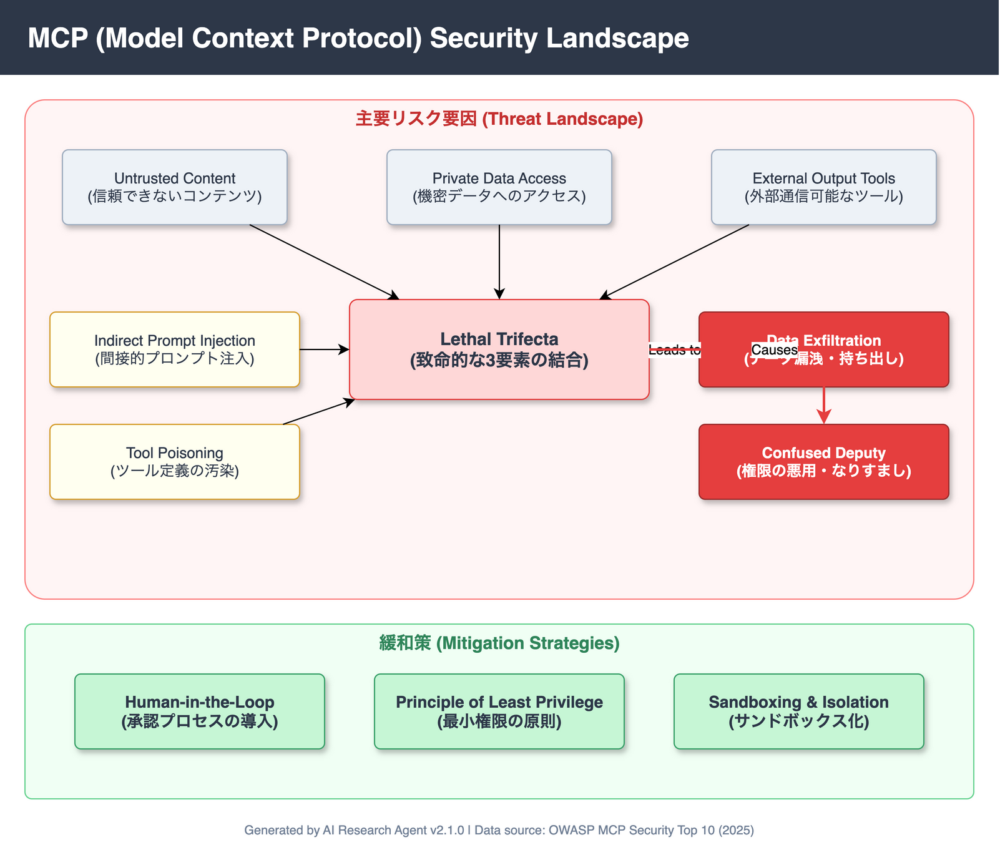

<!-- _class: title -->

# MCP Security Assessment
## Model Context Protocolにおけるセキュリティリスク調査

2026-03-14
Generated by AI Research Agent v2.1.0

---

<!-- _class: light -->

## Executive Summary（エグゼクティブサマリー）

Model Context Protocol (MCP) の普及に伴い、LLMと外部ツール接続における新たな攻撃ベクトルが顕在化しています。

*   **構造的脆弱性**: 従来のAPIリスクに加え、自律的な攻撃リスクが増大
*   **Lethal Trifecta**: 信頼できないコンテンツ・機密データ・外部通信の組み合わせによるデータ流出
*   **Confused Deputy**: 権限過剰付与による「混乱した代理人」問題
*   **実被害の発生**: CVE-2025-6514等の脆弱性が既に報告されている

**結論**: 組織は最小権限・Human-in-the-Loop・サンドボックス化による多層防御を即時に実施する必要があります。

---

<!-- _class: light -->

## Finding 1: プロンプトインジェクションとツール汚染

攻撃者はツール定義や外部データを操作し、エージェントの挙動を制御可能です。 High

*   **Tool Poisoning**: 悪意のあるツール説明文（description）を用いて、LLMに不適切なタイミングでツールを呼び出させる
*   **Indirect Prompt Injection**: メールやファイル等の外部入力に隠された命令により、ユーザーの同意なくアクションを実行
*   **OWASP分類**: Intent Flow Subversion (#6) および Tool Poisoning (#3) として定義

---

<!-- _class: light -->

## Finding 2: Lethal Trifecta（死の三要素）によるデータ流出

特定の3条件が揃う環境下では、データ流出リスクが極めて高まります。 High

1.  **Untrusted Content**: Web検索や外部ファイルへのアクセス権限
2.  **Private Data**: メール履歴や社内文書へのアクセス権限
3.  **External Channel**: メール送信や外部APIへのデータ送信能力

これらの要素が結合することで、インジェクション攻撃による情報窃取が現実的脅威となります。

---

<!-- _class: light -->

## Finding 3: 実証済みの脆弱性とCVE

リスクは理論的な段階を超え、実世界の脅威として顕在化しています。 High

*   **CVE-2025-6514**: 具体的な脆弱性として登録済み
*   **CVE-2025-49596**: 実装上の不備による攻撃可能性
*   **現状**: プロトコル仕様レベルでの認証・アテステーション（証明）の欠如が、根本的な解決を困難にしている

---

<!-- _class: alert -->

## Critical Risks & Warnings

MCP導入における重大なセキュリティ懸念事項です。

*   **サプライチェーン攻撃**: 悪意あるMCPサーバーやプラグインの導入リスク
*   **権限の過剰付与**: デフォルトでフルアクセス権限を与えてしまう設定ミス
*   **監査の困難さ**: LLMの自律的な判断プロセスがブラックボックス化しやすい
*   **プロトコル認証の欠如**: 接続先が正当なサーバーであるか検証する標準的な仕組みが不足

---

<!-- _class: light -->

## Confidence Overview（確信度分布）

本調査における各主張（Claim）の信頼性評価分布です。

| Confidence Level | 件数 | 判定基準 |
|------------------|------|----------|
| High | **18** | 一次情報または複数独立ソースでの裏付けあり |
| Medium | **15** | 信頼できるソースはあるが補強が必要 |
| Low | **0** | 推測を含む、または情報不足 |

※ 総Claim数: 33件、Evidence不足: 2件

---

<!-- _class: light -->

## Architecture & Attack Surface

MCPエコシステムにおける攻撃対象領域：

1.  **Input Layer**:
    ユーザープロンプト、外部ファイル
2.  **Protocol Layer**:
    MCP Client <-> Server通信
3.  **Tool Layer**:
    実行権限、APIアクセス
4.  **Data Layer**:
    機密情報の取り扱い

---

<!-- _class: light -->

## Limitations & Unresolved Issues

現状の調査および技術における未解決の課題です。

*   **プロトコル仕様の未成熟**: 認証・認可の標準仕様が定まっていない
*   **Evidenceの欠落**: 一部の主張（2件）に対して具体的な根拠が提示されていない
*   **対策のコスト**: 完全なサンドボックス化やHuman-in-the-Loopは、UXやパフォーマンスとトレードオフになる可能性がある
*   **検知の難易度**: 自然言語による攻撃パターンの網羅的な検知は困難

---

<!-- _class: success -->

## Strategic Recommendations

組織が取るべき優先的なアクションアイテムです。

1.  **最小権限の原則 (Least Privilege)** High
    *   ツールには必要最小限の権限のみを付与する
2.  **Human-in-the-Loop** High
    *   重要なアクション（データ送信、決済等）の前に必ず人間の承認を挟む
3.  **サンドボックス化** Medium
    *   MCPサーバーを隔離された環境で実行し、システムへの影響を限定する
4.  **多層防御 (Defense in Depth)**
    *   入力フィルタリング、出力検証、監視ログの組み合わせ

---

<!-- _class: dark -->

## Conclusion

**「便利さ」と「安全性」のトレードオフを認識する段階へ**

MCPは強力なプロトコルですが、現在はセキュリティ対策が普及に追いついていません。
**「Lethal Trifecta」** （信頼できない入力・機密データ・外部送信）の状態を避け、
まずは **「人間による承認」** と **「最小権限」** を徹底することが、
最も効果的かつ即効性のある防御策です。
