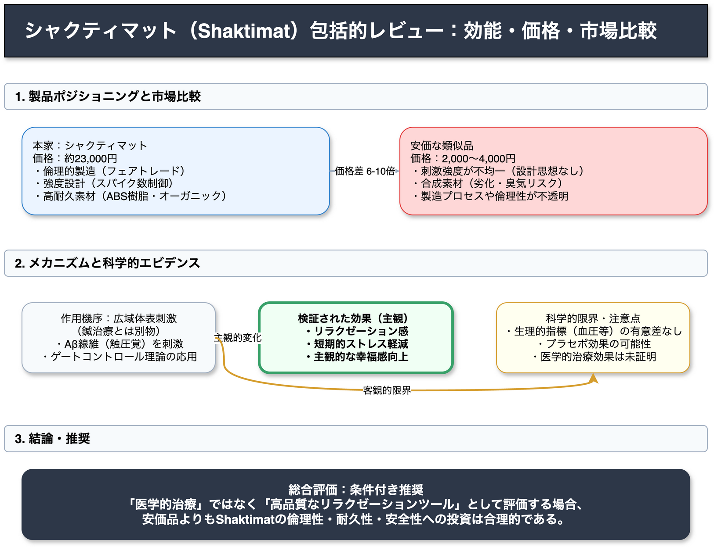

<!-- _class: title -->

# シャクティマット（Shaktimat）徹底検証
## 科学的効能・ユーザー評価・市場比較分析

2026-03-14
AI Research Agent v2.2.0

---

<!-- _class: light -->

## エグゼクティブサマリー

**結論：条件付き推奨**
主観的なストレス軽減には有効ですが、医学的な治療効果は証明されていません。

*   **効能**: 主観的なリラックス効果は高いが、生理学的数値（血圧等）への影響は限定的 Medium
*   **品質**: 安価品と比較し、Shaktimatは耐久性と倫理的製造プロセスで優位 High
*   **メカニズム**: 鍼治療とは異なり、広域体表刺激によるゲートコントロール理論を応用 Medium
*   **価格**: 約22,500円の投資価値は「安全性」と「長期的耐久性」にあり

---

<!-- _class: light -->

## 発見1：リラクゼーション効果のエビデンス

**Claim:**
指圧マットの定期使用は、主観的なストレス低減と幸福感の向上をもたらす。

**Evidence:**
*   3週間のRCT（ランダム化比較試験）において、健康な若年成人群で主観的ストレス減少を確認。
*   ただし、血圧・心拍数などの生理学的指標に有意差はなし。
*   効果の一部は「マット固有」ではなく、「横になって休息する行為」そのものに起因する可能性。

Medium **Mixed Evidence**

---

<!-- _class: light -->

## 発見2：作用機序の科学的妥当性

**Claim:**
鍼治療（Acupuncture）ではなく、ゲートコントロール理論に基づく鎮痛・弛緩作用である。

**Evidence:**
*   **刺激深度**: 鍼は筋肉・深部組織に達するが、マットは表皮〜真皮（0〜数mm）の浅層刺激のみ。
*   **メカニズム**: 広範囲の痛覚受容器を同時刺激することで、痛みの信号伝達をブロック。
*   **反応**: 強い刺激に対する防御反応として、エンドルフィン（脳内麻薬物質）の放出を促す仮説。

Medium **Theory Application**

---

<!-- _class: light -->

## 発見3：本家 vs 安価な類似品

**Claim:**
価格差（約2万円 vs 3千円）は、刺激設計の精密さと安全性に起因する。

**Evidence:**
*   **スパイク設計**: Shaktimatは4,000〜8,000本とレベル別に厳密に管理。安価品は配置がランダム。
*   **固定方法**: Shaktimatは熱圧着（クリップ式）。安価品は接着剤使用が多く、汗や経年劣化での剥離・化学物質リスクがある。
*   **素材**: ABS樹脂（高耐久） vs 一般プラスチック（摩耗しやすい）。

High **Product Spec**

---

<!-- _class: light -->

## 発見4：ユーザー体験の時系列プロセス

**Claim:**
使用体験は「痛み」から始まり「深いリラックス」へと移行する明確なフェーズがある。

**Evidence:**
1.  **Phase 1 (0-2分)**: 鋭い痛み、抵抗感。
2.  **Phase 2 (2-5分)**: 血行促進による温感、痛みの緩和。
3.  **Phase 3 (5-20分)**: 筋肉の緊張が解け、深いリラクゼーション状態へ。
4.  **注意点**: 初回は薄手の服を着用し、徐々に素肌へ移行することが推奨される。

High **User Consensus**

---

<!-- _class: alert -->

## 重大なリスクと禁忌（Warning）

購入前に以下の医学的リスクを確認する必要があります。

*   **妊娠中の方**: オキシトシン放出の可能性があり、使用不可。
*   **皮膚疾患**: 湿疹、乾癬、傷口がある場合は悪化のリスク。
*   **循環器系疾患**: 血行への急激な影響や、起立時のめまい（立ちくらみ）のリスク。
*   **血液凝固障害**: 抗凝固薬服用中は内出血のリスク。
*   **感覚障害**: 糖尿病性神経障害などで痛みを感じにくい場合は使用不可。

---

<!-- _class: light -->

## 確信度（Confidence）の分布

本調査における情報の信頼性評価分布です。製品仕様に関する信頼性は高い一方、医学的効果については慎重な解釈が必要です。

| レベル | 件数 | 内容の傾向 |
|:---:|:---:|---|
| High | 27 | 製品スペック、価格、製造プロセス、ユーザー体験の共通項 |
| Medium | 25 | 生理学的メカニズムの仮説、限定的な臨床試験結果 |
| Low | 6 | 具体的な病気治癒への効果、長期的な医学的予後 |

---

<!-- _class: light -->

## マットの構造と刺激メカニズム

*   **スパイク形状**: 蓮の花（ロータス）等を模した円形ディスク上に多数の突起。
*   **圧力分散**: 6,000本以上のスパイクで体重を分散させることで、皮膚を穿刺することなく強い刺激を与える。
*   **素材構成**:
    *   表面: オーガニックコットン
    *   突起: ABS樹脂（耐久性・低アレルギー）
    *   内部: リサイクルフォームまたはココナッツ繊維

---

<!-- _class: light -->

## 調査の限界（Limitations）

現在入手可能なエビデンスには以下の限界があります。

1.  **サンプルサイズ**: 既存の研究は小規模（数十人規模）かつ短期間のものに限られる。
2.  **プラセボ対照の困難**: 「刺激のないマット」を作ることが難しく、ブラインドテストが困難。
3.  **バイアス**: 多くの肯定的報告はユーザーレビュー（購入者バイアス）やメーカー主導の情報に基づく。
4.  **因果関係**: リラックス効果が「マットの刺激」によるものか、「時間を取って休むこと」によるものか分離できていない。

---

<!-- _class: success -->

## 推奨アクション（Recommendations）

**対象ユーザー**:
日常的なストレスケア、リラクゼーション、倫理的消費を重視する層。

1.  **製品選択**: 初めての場合は「Original（約6,000本）」を選択する。刺激が強すぎるリスクを避ける。
2.  **使用法**: 最初はベッド等の柔らかい場所で、薄手の衣服を着て10分から開始する。
3.  **期待値調整**: 「腰痛の治療」ではなく「リラクゼーション・ケア」ツールとして導入する。
4.  **安全確認**: 基礎疾患がある場合は医師に相談の上使用する。

---

<!-- _class: dark -->

## 結論（Conclusion）

**Shaktimatは「魔法の治療器」ではありませんが、信頼できる「リラクゼーションツール」です。**

科学的根拠は発展途上ですが、多くのユーザーが実感する主観的メリットは無視できません。安価な代替品に対する約7倍の価格差は、**「計算された刺激密度」「安全性」「倫理的製造」**によって正当化されます。

> **Final Verdict**: 
> 治療効果を過信せず、質の高い休息のための投資として導入を推奨します。
