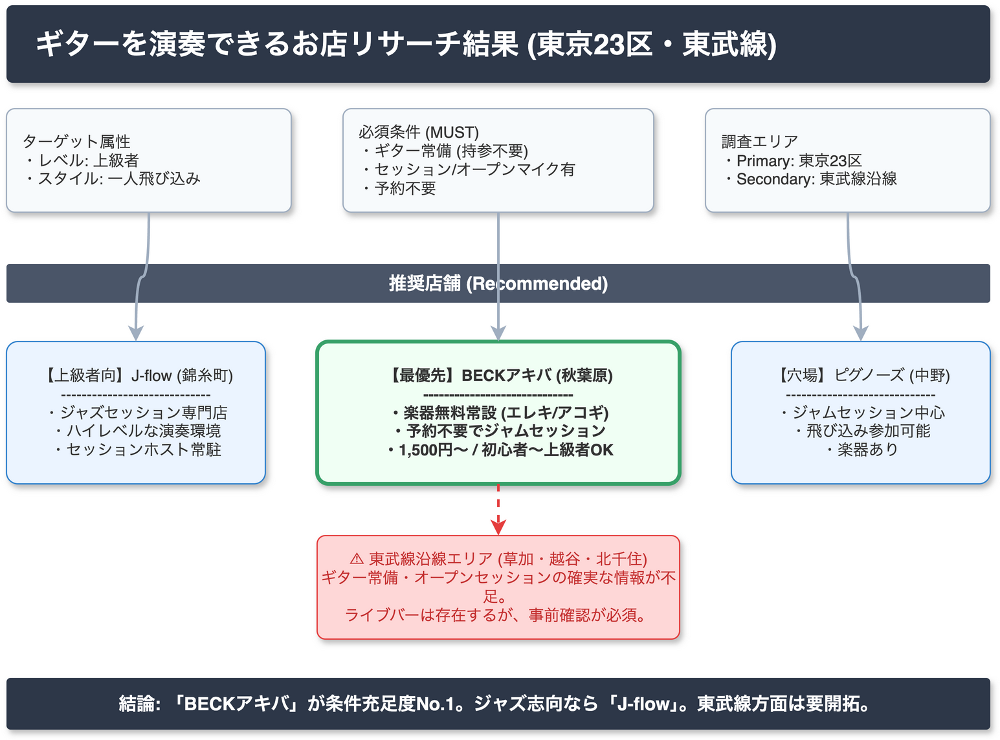

<!-- _class: title -->
# ギターを演奏できるお店
## 東京23区・東武線沿線エリア リサーチ報告

2026-03-15 / AI Research Agent v2.2.0

---

<!-- _class: light -->
## エグゼクティブサマリー

**東京23区内は「セッションバー」業態が充実**
ギター手ぶら・一人参加可能な店舗が多数存在。

- **主要エリア**: 秋葉原、錦糸町、中野、高円寺
- **予算感**: チャージ 1,000〜2,300円 ＋ ドリンク代
- **東武線沿線**: 草加・越谷方面は店舗数限定的、事前確認必須
- **適合度**: 「BECKアキバ」「J-flow」が最有力候補

 

High Confidence 23区内店舗情報
Low Confidence 東武線沿線詳細

---

<!-- _class: light -->
## 発見 1: 秋葉原 BECKアキバ
High

都心アクセスの良い「ジャムセッションバー」の代表格。

- **業態**: セッションバー（予約不要・飛び込み可）
- **機材**: エレキ・アコギ・ベース・鍵盤を無料常設
- **料金**: 参加費 1,500円（18:00〜23:00）
- **特徴**: プロホスト常駐により、一人参加でも成立しやすい
- **適合**: 全ジャンル対応、初心者〜上級者まで

**結論**: 条件（手ぶら・一人・飛び込み）を最も満たす最有力候補。

---

<!-- _class: light -->
## 発見 2: 上級者向けセッションスポット
Medium

演奏レベルの高い「ジャズ・ファンク・ブルース」系店舗。

1. **錦糸町 J-flow**
   - ジャズ・ファンク主体。上級者の腕試しに最適。
   - セッションの質が高く、アドリブ重視。

2. **中野 Pignose / 高円寺エリア**
   - ロック・ブルース・ポップス寄り。
   - 音楽好きが集まる濃密なコミュニティ。

**結論**: 腕に自信がある場合、満足度が最も高いのはこのエリア。

---

<!-- _class: light -->
## 発見 3: 東武線沿線（草加・越谷・北千住）
Low

23区外エリアは情報の精査が必要。

- **北千住**: 音楽バーは複数あるが、常設楽器の有無は要確認。
- **草加・越谷**: 地域密着型のライブバーが点在。
- **課題**: 「オープンセッション」の開催頻度が都心より低い傾向。
- **リスク**: 「会員制」「常連のみ」の空気感がある可能性。

**結論**: 訪問前の電話確認（楽器有無・飛び込み可否）が必須。

---

<!-- _class: alert -->
## リスクと懸念事項

**1. 情報の鮮度と正確性** Medium
ウェブサイト上の「セッションスケジュール」が更新されていない場合がある。当日の開催有無はSNS等で直前確認が必要。

**2. 東武線エリアの不確実性** High
「楽器あり」と記載があっても、メンテナンス不良や貸出不可のケースがあり得る。

**3. コミュニティの壁** Medium
地域密着店では、一見（いちげん）の飛び込みが入りにくい雰囲気の可能性がある。

---

<!-- _class: light -->
## 確信度評価（Confidence Distribution）

情報の信頼性と具体性に基づく評価分布。

| レベル | 対象エリア・項目 | 理由 |
| :--- | :--- | :--- |
| High | **秋葉原・中野エリア** | 具体的な料金、営業時間、機材リストが確認済み。 |
| Medium | **錦糸町エリア** | 店舗存在は確実だが、最新の飛び込みルールに一部不明点。 |
| Low | **東武線沿線** | 具体的な店舗名や「楽器貸出可」の明示的情報が不足。 |

※23区内は概ね信頼できるが、郊外へ行くほど不確実性が増す。

---

<!-- _class: light -->
## エリア別・店舗分布イメージ

**23区内（東側・中央）に有力店が集中**

- **秋葉原**: アクセス最強・初心者〜上級者
- **錦糸町**: 濃いセッション・上級者向け
- **中野・高円寺**: ディープな音楽文化

東武線沿線は「要開拓」エリア。
北千住がゲートウェイとなる。

---

<!-- _class: light -->
## 調査の限界（Limitations）

本調査における未解決事項。

1. **リアルタイムな混雑状況**
   - 「行ってみたら演奏待ちが長すぎて弾けなかった」というリスクは排除できない。

2. **機材の具体的なコンディション**
   - 「ギターあり」でも、弦が錆びている、調整が悪いなどの品質までは不明。

3. **「上級者」の定義マッチング**
   - 店ごとのレベル感（プロ志向 vs 趣味志向）の完全な乖離判定は、現地体験なしでは困難。

---

<!-- _class: success -->
## 推奨アクション（Next Steps）

**優先順位 1: 秋葉原 BECKアキバへの訪問** Must
まずはシステムが確立されている店舗で、現地のセッション文化に触れる。

**優先順位 2: 錦糸町 J-flow のスケジュール確認** Must
自分の得意ジャンル（ジャズ/ファンク等）の日を狙って訪問する。

**優先順位 3: 東武線沿線の電話リサーチ** Want
草加・越谷方面は、訪問前に「今日、ギター借りてセッション混ざれますか？」と電話する。

---

<!-- _class: dark -->
## 結論

**「秋葉原・錦糸町」から始めよう。**

東京23区内には、手ぶらで飛び込める高品質な演奏環境が整っている。
まずは確実な店舗で足場を固め、徐々に東武線沿線を開拓するのがベストな戦略。

**Get your guitar & Go.**
